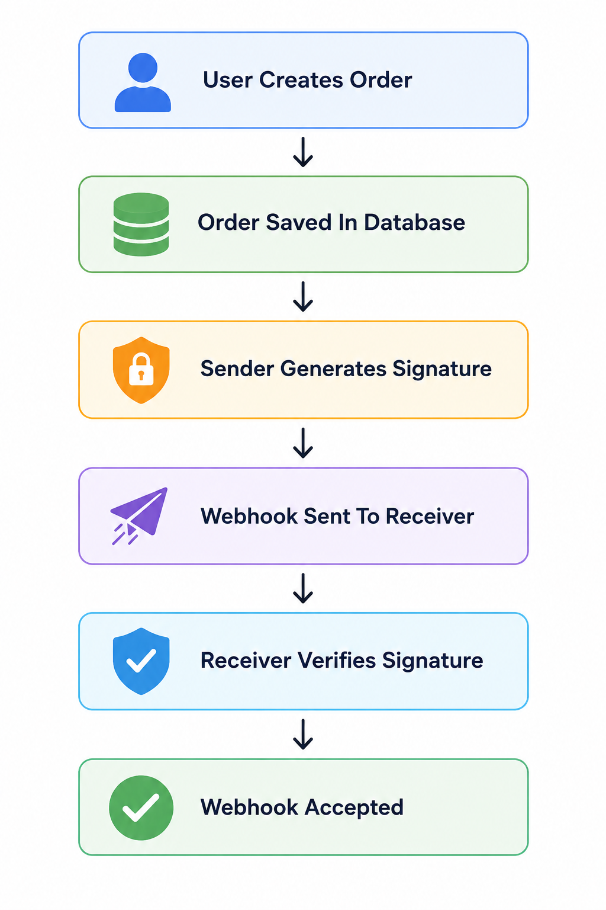
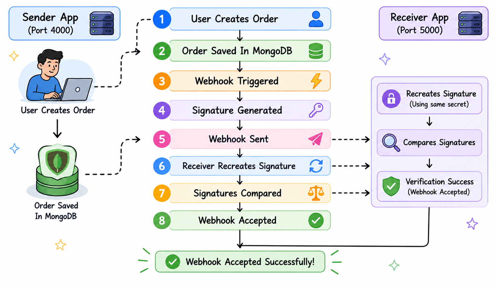

# Building a Secure Webhook using Node.js

A webhook?! 
That's the first question I had when I first read it. 
I checked on the internet for the meaning.
And it said, "An automated, event-driven method for one application to send real-time data to another". 
Now the real question is - Did you understand what that meant?
Yes, even I felt like it's technically deep.

That's when I decided to build one!
This project is the result of that.

By the end of this project, we will understand:
-What webhooks really are?
-What is HMAC and why we use?
-How two backend systems work?
-How webhook verification works?

The problem we are solving with webhook:
Suppose, you have a online store. The customer drops an order. To deliver this order, the warehouse team should be aware of the order creation. So, they will keep guessing:
-Is there any new order?
-Is there any new order now?
-How about now?
That's so inefficient!!!!

Instead, the online store should send the notification to the warehouse team automatically, that order is created.
That automatic notification is nothing but the WEBHOOK!!
Simple right??

So, A webhook is an HTTP request sent from one system to another when an event is triggerred.

In this Project:
#Sender: creates Orders
#Reciever: gets the notification about the order

So we have two backend system 
1. Sender
    -creates orders
    -stores them in MongoDB
    -sends webhook events
2. Reciever
    -receives webhook requests
    -verifies they are authentic
    -accepts or rejects them

Here's the entire flow of the systems



It's seems simple. But there are lot of interesting things happening inside.

Let's dive into the code.

Sender App is the root of the whole project.
its runs on http://localhost:4000

```python
import express from "express";
import dotenv from "dotenv";
import connectDB from "./db/connectDB.js";
import orderRoutes from "./routes/orderRoutes.js";

dotenv.config();

const app = express();

app.use(express.json());

connectDB();

app.use(orderRoutes);

const PORT = 4000;

app.listen(PORT, () => {
  console.log(`Sender running on port ${PORT}`);
});
```
Before the Sender App receives the HTTP request(order) we set up the Express framework, MongoDB must be connected, routes must be registered. Here, sender server basically gets ready and waits for the request. In our example, its the warehouse waiting for the order request.


```python
import express from "express";
import Order from "../models/Order.js";
import sendWebhook from "../services/webhookService.js";

const router = express.Router();

router.post("/orders", async (req, res) => {
  try {
    const { amount, status } = req.body;

    const newOrder = await Order.create({
      amount,
      status,
    });

    sendWebhook(newOrder);
    res.status(201).json({
      message: "Order created",
      order: newOrder,
    });
  } catch (error) {
    res.status(500).json({
      message: error.message,
    });
  }
});

export default router;
```

When we make a POST /order request from Postman,and if the path is matched with the    ```python
router.post("/order")
```, the db values are extracted from req.body and document is created and saved in MongoDB.

Here the router solves a huge problem:
Without routes the Sender server exists but it's of no use.So, ain't we solving a problem by
-accepting orders
-saving the orders
-trigerring the notifications
here?

Yes, Right after saving the order data, the webhook concept starts when the control flow goes to the line ```python
sendWebhook(newOrder);
``` This tells the reciever App, that the new order is created.

Thus, we are here with the most important concept HMAC.

```python
import axios from "axios";
import crypto from "crypto";

const SECRET = "mysecretkey";

const RECEIVER_URL = "http://localhost:5000/webhook";

function generateSignature(timestamp, body) {
  const payload = `${timestamp}.${body}`;

  return crypto.createHmac("sha256", SECRET).update(payload).digest("hex");
}

async function sendWebhook(orderData, retryCount = 0) {
  try {
    const rawBody = JSON.stringify(orderData);

    const timestamp = Math.floor(Date.now() / 1000);

    const signature = generateSignature(timestamp, rawBody);

    const response = await axios.post(RECEIVER_URL, rawBody, {
      headers: {
        "Content-Type": "application/json",
        "X-Webhook-Timestamp": timestamp,
        "X-Webhook-Signature": signature,
      },
    });
    console.log("Webhook Success", response.status);
  } catch (error) {
    console.log("Webhook Failed");

    if (retryCount < 3) {
      const delays = [1000, 3000, 9000];

      const delay = delays[retryCount];

      console.log(`Retrying in ${delay / 1000} seconds`);

      setTimeout(() => {
        sendWebhook(orderData, retryCount + 1);
      }, delay);
    } else {
      console.log("Maximum retries completed");
    }
  }
}

export default sendWebhook;
```
So, by now we know, Sender sends the notification to the Reciever. But, what if it's a fake webhook request?? 
How will the reciever know:
-Who sent the request?
-Is the payload modified?
-if someone forged the request?
This is where HMAC authentication steps in.

HMAC (Hash-Based Message Authentication Code) is a cryptographic technique that ensures data integrity and authenticity using a hash function and a secret key. The cryptographic hash function may be MD-5, SHA-1, or SHA-256.

HMACs provides Sender and Reciever with a shared secret key that is known only to them. When the Sender requests the Reciever, it hashes the requested data with the secret key and sends it along the request. When the Sender receives the request, it makes its own HMAC. Both the HMACS are compared and if both are equal, the Sender is said to be genuine. 

```python
const RECEIVER_URL = "http://localhost:5000/webhook";
```
this is the reciever address where webhook events are delivered.


```python
function generateSignature(timestamp, body) {
  const payload = `${timestamp}.${body}`;

  return crypto.createHmac("sha256", SECRET).update(payload).digest("hex");
}
```
We process the payload with timestamp and order data and get back HMAC authenticated signature.
HMAC is like the Cofee Machine and Signature is its end product that is the Coffee itself!!!
So, now we have our rawdata, timestamp and signature.
We send all these to the recievers address, just like the ingredients we gather before we cook.

Did you realize we just finished our Sender side process?!
That was quick than I actually thought it to be. Quicker to learn and quicker to write as well...

Finding it interesting????.....

Okay, lets move to the final part. You are just there!!

Before that, lets see: what if the webhook request fails?
We know the network issues, server crash,Connections timeout that creates failure in request-response cycle..so what do we do??
No worries. We have the solution below:

```python
 if (retryCount < 3) {
      const delays = [1000, 3000, 9000];

      const delay = delays[retryCount];

      console.log(`Retrying in ${delay / 1000} seconds`);

      setTimeout(() => {
        sendWebhook(orderData, retryCount + 1);
      }, delay);
    } else {
      console.log("Maximum retries completed");
    }
```
So, we have retries.
The webhook request retries the failed deliveries after 1 second, 3 seconds, 9 seconds and make it work. 

As we discussed, diving onto the Reciever App.
Reciever App runs on : http://localhost:5000
Its job is simple, check if the incoming requests are genuine.

```python
import express from "express";
import webhookRoutes from "./routes/webhookRoutes.js";

const app = express();

app.use(webhookRoutes);

const PORT = 5000;

app.listen(PORT, () => {
  console.log(`Receiver running on port ${PORT}`);
});
```
Similar to Sender side, here the reciever starts the server, sets up the routes and waits for the webhook requests.

```python
const router = express.Router();

const SECRET = "mysecretkey";

router.post(
  "/webhook",
  express.raw({ type: "application/json" }),
  (req, res) => {
    try {
      const signature = req.headers["x-webhook-signature"];

      const timestamp = req.headers["x-webhook-timestamp"];
      if (!signature) {
        return res.status(400).json({
          message: "Missing signature",
        });
      }

      if (!timestamp) {
        return res.status(400).json({
          message: "Missing timestamp",
        });
      }
```
When the router.post("/webhook") matches the incoming webhook request, the Reciever extracts the meta data sent by the Sender. Before verification it checks if signature and timestamp are existing in headers. If its present, goes to next step, otherwise returns missing message.

```python
      const payload = `${timestamp}.${rawBody}`;

      const expectedSignature = crypto
        .createHmac("sha256", SECRET)
        .update(payload)
        .digest("hex");
      if (signature !== expectedSignature) {
        return res.status(401).json({
          message: "Invalid signature",
        });
      }

      const parsedData = JSON.parse(rawBody);

      console.log("Verified Payload");
      console.log(parsedData);

      return res.status(200).json({
        message: "Webhook verified successfully",
      });
    } catch (error) {
      return res.status(500).json({
        message: error.message,
      });
    }
  },
);
```
Now, the Reciever recreates the same payload like the Sender used because both Sender and Reciever should create signature from identical data otherwise verification fails.Because for different data the signature changes internally. With that we create Reciever's own signature version from same data using HMAC as we discussed before. 

We then compare the signature coming from Sender with that of the Reciever, if it differs the webhook fails otherwise ITS SUCCESSFULL!!!!!
Thus, we know the order created by Sender is valid and genuine. And Warehouse can proceed with the delivery of the order.

The final flow:


#Key Implementation Decisions

1. Reciever uses 
```python
express.raw({ type: "application/json" })
```
instead of
```python
express.json()
```
This preserves the body exactly as it arrived. Otherwise, they yield different strings, resulting in different signatures. This decision ensures accurate HMAC verification.

2. Using Timestamps
```python
const timestamp = Math.floor(Date.now() / 1000);
```
Without timestamps webhook becomes vulnerable to replay attacks. When the attacker captures the real webhook request it can send it later any number of times. System thinks it's genuine and can process duplicate payments. That becomes dangerous. Timestamps avoid it.

3. Using Retry logic
```python
const delays = [1000, 3000, 9000];
```
We know real requests are unreliable. Server may crash because for several reasons. and we give up. To avoid this, project retries failed requests after 1 sec, 3 sec, 9 sec. This make the system more reliable.

FINAL THOUGHTS
==============

After building this project, din't we start seeing the same exact patterns everywhere??

For example, let's imagine Razorpay
The moment payment succeeds, the payment gateway immediately notify the application and the application knows : payment succeeded --> order can now be processed --> inventory should be updated --> Invoice can be generated --> Confirmation email can be sent.
The payment provider need not keep asking the application about the status of payment every minute. Instead, payment provider sends the webhook event immediately.
